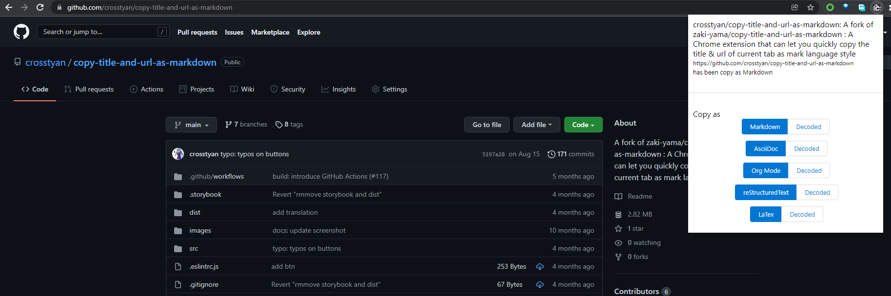

# Focked Copy Title & Url as Markdown Style

This is a fork of [Copy Title & Url as Markdown Style](https://github.com/zaki-yama/copy-title-and-url-as-markdown)

Quickly copy the title & url of current tab as Markdown or other style (`[title](url)`).



Suppported styles:

- Markdown
- AsciiDoc
- Org Mode
- reStructuredText
- LaTeX

## Installation & Usage

### Compiling

If you are using Node.js 17 or higher, you must include `--openssl-legacy-provider` in `NODE_OPTIONS` environment variable. Here is how to do it in PowerShell

[How To Fix ERR_OSSL_EVP_UNSUPPORTED In React JS Application - Roy Tutorials](https://roytuts.com/how-to-fix-err_ossl_evp_unsupported-in-react-js-application/)

```powershell
$env:NODE_OPTIONS="--openssl-legacy-provider"
```

What you need to do then is

```bash
yarn run dev-build
```

I'm not sure why but the code refuses to run with production build. (minimized code build with webpack)

If there is any error like

```bash
rm: cannot remove 'dist/*.js': No such file or directory
```

just create a dummy `.js` file in `dist` folder.

I won't publish it to Chrome Store. 